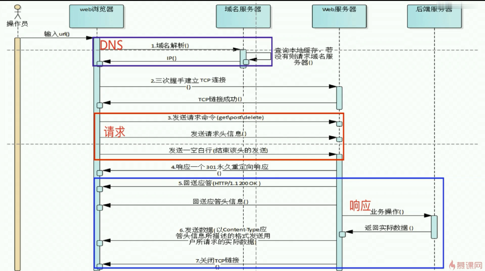

#### 解读HTTP请求流程
##### 请求流程图

##### 请求流程
	1.DNS域名解析
	2.三次握手建立TCP链接
	3.发送请求命令(get\post\delete\put)
	4.相应一个301永久重定向响应
	5.回送应答(HTTP/1.1 200K)
	6.发送数据(以Content-Type 应答信息所描述的格式发送用户锁清秋的实际数据)
	7.关闭TCP链接
##### HTTP知识点
	1.DNS服务：将域名转换成ip地址后返回给浏览器
	2.HTTP请求
	3.HTTP相应