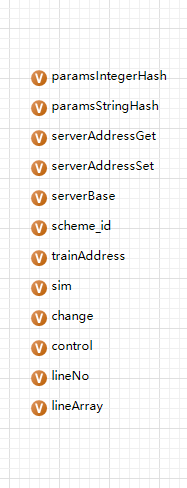

#### 模型接口编写模板
##### 第一步：模型参数改变

| 参数名 | 数据类型 | 参数描述 |
| paramsIntegerHash | HashMap<String,ArrayList<Integer>> | 车站需要的Integer数据 |
| paramsStringHash | HashMap<String,ArrayList<String>> | 车站需要的时间数据 |
| serverAddressGet | String | 获取数据地址 |
| serverAddressSet | String | 2d输出数据地址 |
| serverBase | String | 基础路由地址 |
| trainAddress | String | 列车信息输出地址 |
| sim | String | 乘客信息输出地址 |
| change | String | 动态参数获取地址 |
| control | String | 动态控制命令输出 |
| lineNo | String | 线路号字符串 |
| lineArray | String[] | 线路号数组 |

